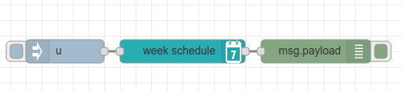
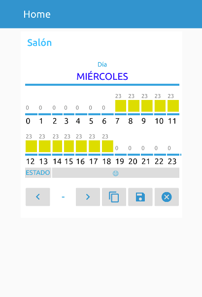

## Node-RED Week Schedule
A week schedule for the Node-RED Dashboard





## TODO

* i18n

## Install
To install the node run the following from your Node-RED user directory (`~/.node-red`):
```bash
npm install node-red-contrib-ui-week-schedule
```

Or install the node from the Palette section of your Node-RED editor by searching by name (`node-red-contrib-ui-week-schedule`).

## Example

```json
[{"id":"50f3ba76.d42d44","type":"tab","label":"Flow 1","disabled":false,"info":""},{"id":"20cc9134.d017fe","type":"debug","z":"50f3ba76.d42d44","name":"","active":true,"tosidebar":true,"console":false,"tostatus":false,"complete":"false","x":190,"y":540,"wires":[]},{"id":"4c56c509.b197ac","type":"ui_week_schedule","z":"50f3ba76.d42d44","group":"4501e1fb.1f3b5","order":0,"label":"","name":"","width":0,"height":0,"x":200,"y":300,"wires":[["7995e074.3eea6"]]},{"id":"ede1d388.6f1df","type":"json","z":"50f3ba76.d42d44","name":"","property":"payload","action":"","pretty":false,"x":170,"y":180,"wires":[["950fb1a1.b9919"]]},{"id":"793789b2.67c848","type":"file in","z":"50f3ba76.d42d44","name":"~/week_schedule.json","filename":"/home/victor/week_schedule.json","format":"utf8","chunk":false,"sendError":false,"encoding":"none","x":220,"y":120,"wires":[["ede1d388.6f1df"]]},{"id":"950fb1a1.b9919","type":"function","z":"50f3ba76.d42d44","name":"payload → timing","func":"msg.timing = msg.payload;\nreturn msg;","outputs":1,"noerr":0,"x":210,"y":240,"wires":[["4c56c509.b197ac"]]},{"id":"ea7be167.3838f","type":"inject","z":"50f3ba76.d42d44","name":"","topic":"","payload":"true","payloadType":"bool","repeat":"","crontab":"","once":true,"onceDelay":0.1,"x":190,"y":60,"wires":[["793789b2.67c848"]]},{"id":"7995e074.3eea6","type":"function","z":"50f3ba76.d42d44","name":"timing → payload","func":"if (msg.save) {\n    msg.payload = msg.save;\n    return msg;\n}","outputs":1,"noerr":0,"x":210,"y":360,"wires":[["8ff0280c.5f4c18"]]},{"id":"922ff897.9ba0b8","type":"file","z":"50f3ba76.d42d44","name":"~/week_schedule.json","filename":"/home/victor/week_schedule.json","appendNewline":false,"createDir":false,"overwriteFile":"true","encoding":"none","x":220,"y":480,"wires":[["20cc9134.d017fe"]]},{"id":"8ff0280c.5f4c18","type":"json","z":"50f3ba76.d42d44","name":"","property":"payload","action":"str","pretty":false,"x":170,"y":420,"wires":[["922ff897.9ba0b8"]]},{"id":"4501e1fb.1f3b5","type":"ui_group","z":"","name":"Salón","tab":"4d9a93e1.0bf18c","disp":true,"width":"6","collapse":false},{"id":"4d9a93e1.0bf18c","type":"ui_tab","z":"","name":"Home","icon":"dashboard","disabled":false,"hidden":false}]
```
